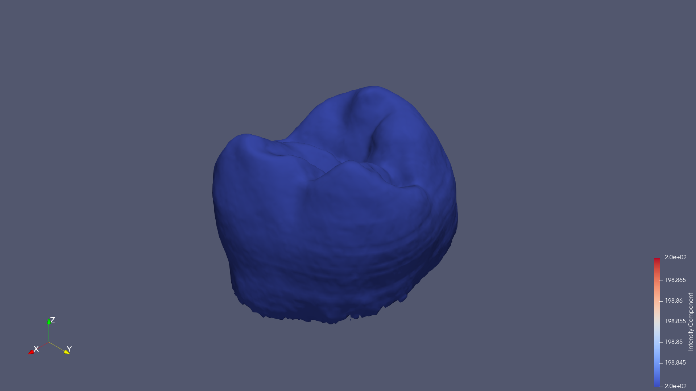

# Paraview Skills

> **Early Stage Project**: These skills are in early development and may contain bugs or unexpected behaviors. Contributions, bug reports, and discussions are very welcome!

Claude Code skills for scientific visualization with ParaView. These skills trying to enable Claude CLI to help you create and manipulate 3D scientific visualizations including volume rendering, isosurfaces, streamlines, and more.


## Prerequisites

- [ParaView](https://www.paraview.org/download/) 5.10+ installed
- Python 3.10+
- [Claude Code](https://docs.anthropic.com/en/docs/claude-code) CLI

## Installation

### Quick Install

```bash
# Clone into your Claude Code skills directory
git clone https://github.com/TouKaienn/Paraview-Skill.git ~/.claude/skills/paraview
```

### Manual Install

1. Download or clone this repository
2. Copy to `~/.claude/skills/paraview/`
3. Ensure the directory structure looks like:


## Configuration

Set the `PARAVIEW_HOME` environment variable to point to your ParaView installation:

```bash
# Add to ~/.bashrc or ~/.zshrc
export PARAVIEW_HOME=/path/to/ParaView-5.12.1

# Example paths:
# Linux: /opt/ParaView-5.12.1
# macOS: /Applications/ParaView-5.12.1.app/Contents
# Windows: C:\Program Files\ParaView 5.12.1
```


## Example Case: Tooth Isosurface Visualization

This example demonstrates using Claude Code with the ParaView skill to visualize a RAW volume dataset.

### Prompt 1: Initial Isosurface Rendering

**User:**
> Can you visualize this volume `/path/to/tooth_103x94x161_uint8.raw` with iso-surface rendering? Save the rendering as `tooth_isosurface.png`


**Result:**


### Prompt 2: Adjust Isovalue for Half Surface Area

**User:**
> Can you choose a good isovalue that only have half surface of this rendering `/path/to/tooth_isosurface.png`?


**Result:**




---


## License

MIT License - see [LICENSE](LICENSE) for details.

## Contributing

Contributions are welcome! Please feel free to submit issues or pull requests.

## Acknowledgments

- [ParaView](https://www.paraview.org/) - Open-source scientific visualization
- [Claude Code](https://docs.anthropic.com/en/docs/claude-code) - AI-powered coding assistant
- [ParaView MCP](https://github.com/llnl/paraview_mcp) - ParaView Model Context Protocol server by LLNL
- [ChatVis](https://github.com/tanwimallick/ChatVis/) - LLM-based scientific visualization generation
